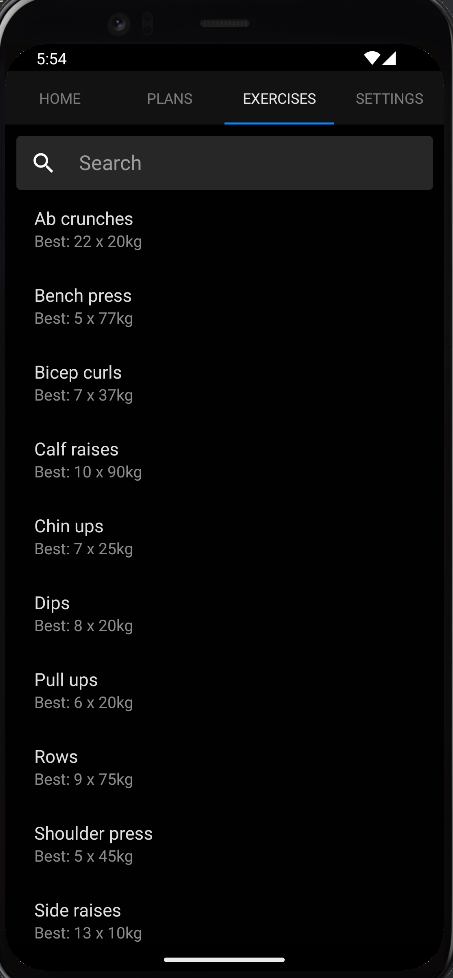

# Massive

Massive tracks your reps and sets at the gym. No internet connectivity or high spec device is required.





# Installation

The easiest installation method on Android devices is to download [the APK](https://brandon.presley.nz/massive.apk).

# Building from Source

First follow the [React Native Environment Setup](https://reactnative.dev/docs/environment-setup). Then run the following command:

```sh
cd android
./gradlew bundleRelease
```

The apk file can be found at `./app/build/outputs/apk/release/app-release.apk`

# Running in Development

First ensure Node.js dependencies are installed:

```
yarn install
```

Then start the metro server:

```
yarn start
```

Then run the `android` script:

```
yarn android
```
