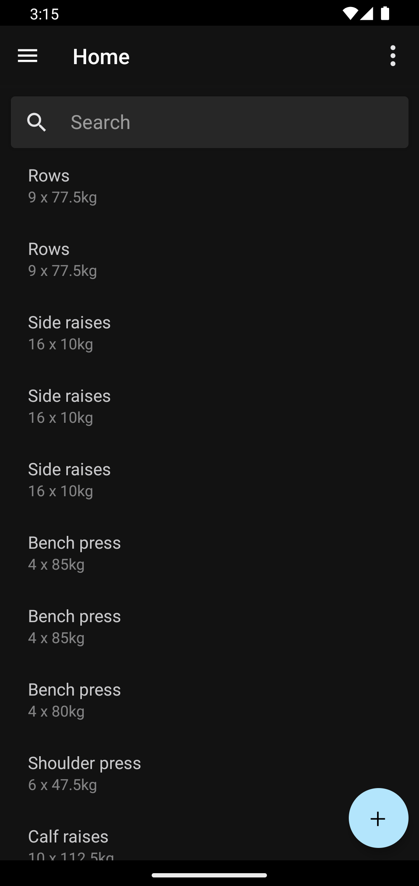
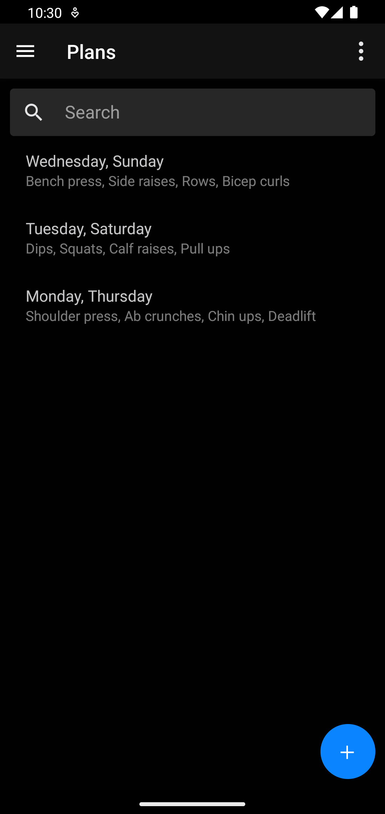
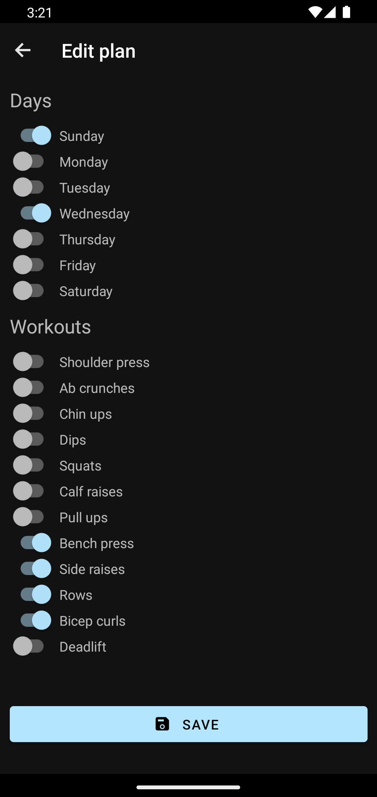
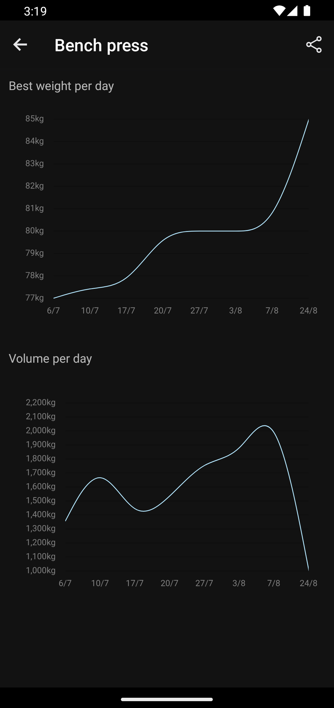
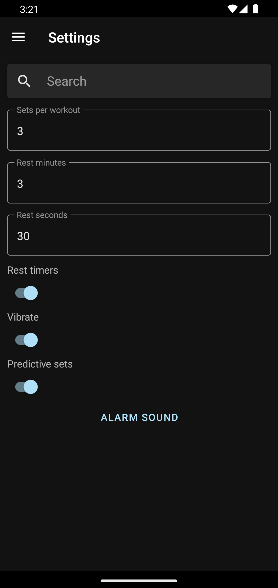

# Massive

Massive tracks your reps and sets at the gym. No internet connectivity or high spec device is required.











# Installation

<a href='https://play.google.com/store/apps/details?id=com.massive&pcampaignid=pcampaignidMKT-Other-global-all-co-prtnr-py-PartBadge-Mar2515-1'>
  
</a>

# Building from Source

First follow the [React Native Environment Setup](https://reactnative.dev/docs/environment-setup). Then run the following command:

```sh
cd android
./gradlew assembleRelease
```

The apk file can be found at `./app/build/outputs/apk/release/app-release.apk`

# Running in Development

First ensure Node.js dependencies are installed:

```
yarn install
```

Then start the metro server:

```
yarn start
```

Then run the `android` script:

```
yarn android
```
