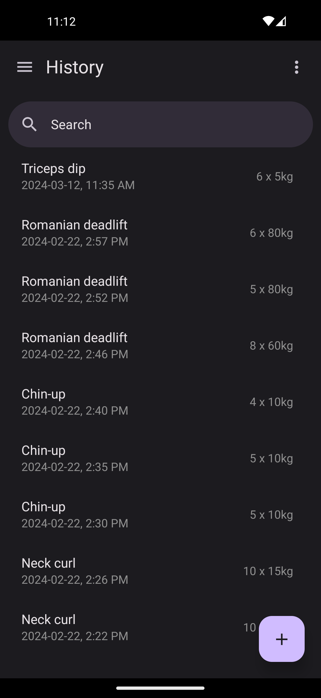
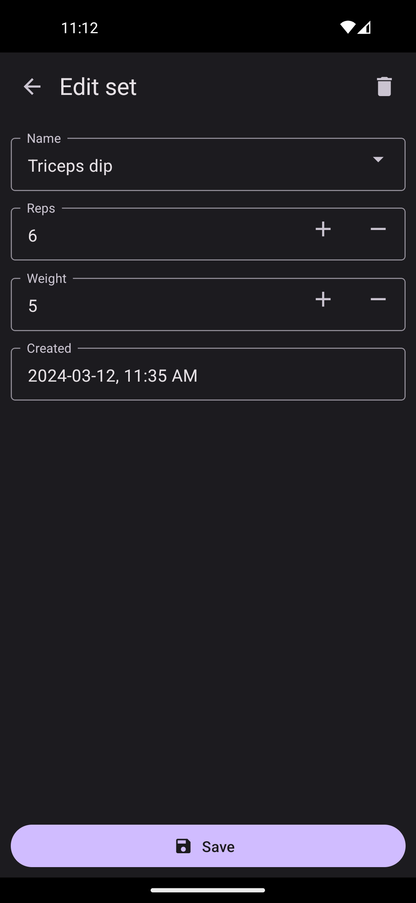
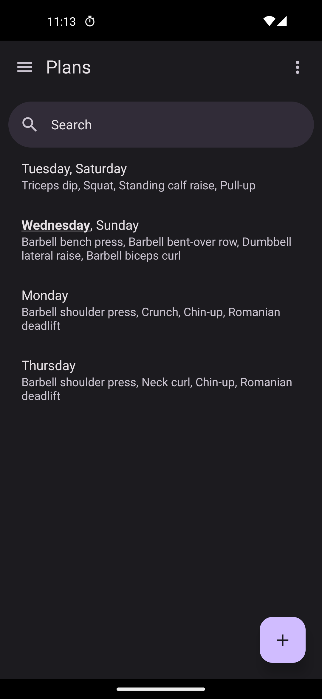
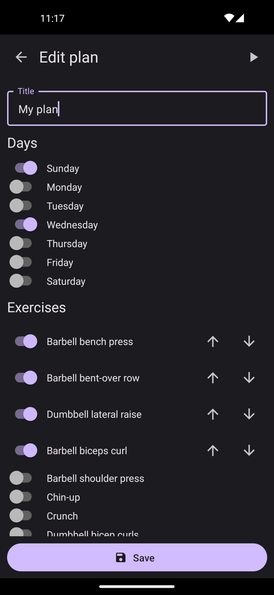
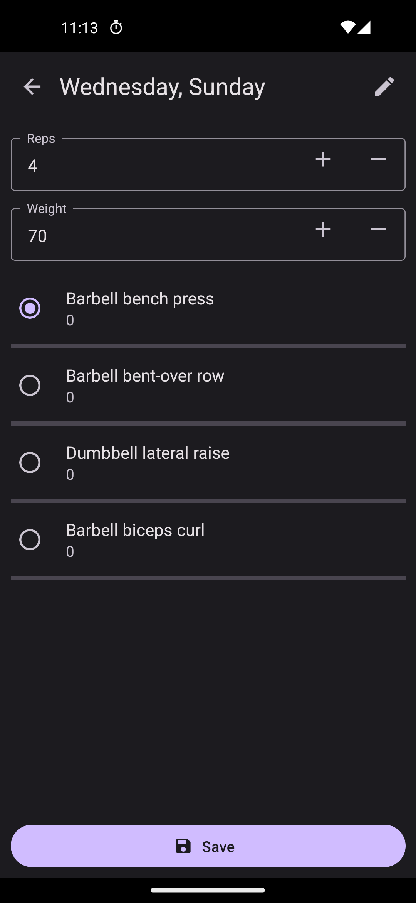
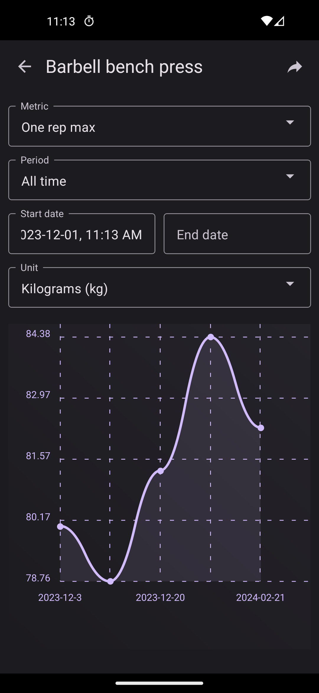
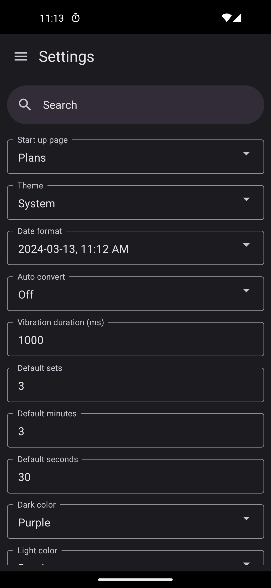
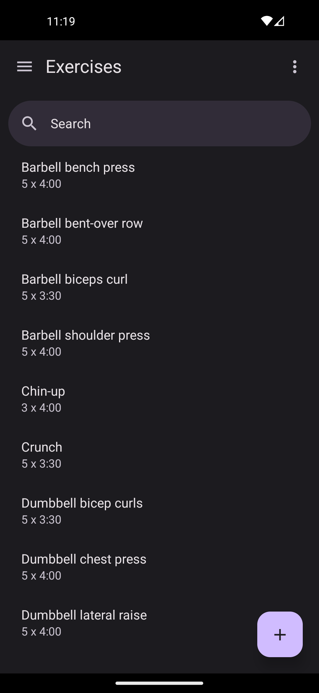
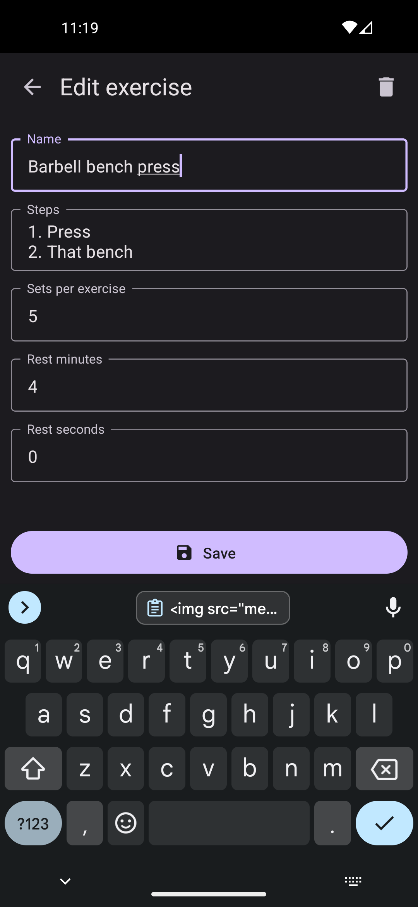

# Massive

**This app is now deprecated**

Please install [Flexify](http://github.com/brandonp2412/Flexify) instead.

Massive tracks your reps and sets at the gym. No internet connectivity or high spec device is required.
<br />
<br />


## Features

- Track weight, reps and sets
- Rest timers after each set
- Progress graphs
- Day planner

<a href="https://play.google.com/store/apps/details?id=com.massive">
  
</a>
<a href="https://f-droid.org/en/packages/com.massive">
  
</a>

# Screenshots












# Building from Source

First follow the [React Native Environment Setup](https://reactnative.dev/docs/environment-setup). Then run the following command:

```sh
cd android
./gradlew assembleRelease
```

The apk file can be found at `android/app/build/outputs/apk/release/app-release.apk`

# Running in Development

First ensure Node.js dependencies are installed:

```
npm install
```

Then start the metro server:

```
npm start
```

Then (in a separate terminal) run the `android` script:

```
npm run android
```

# Fdroid Metadata

You can find the metadata yaml file in the fdroiddata repository:
https://gitlab.com/fdroid/fdroiddata/-/blob/master/metadata/com.massive.yml
